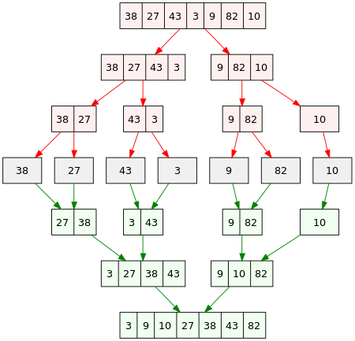

## what is Mergesort?



Mergesort is a classic example of the "divide-and-conquer" approach. It sorts an array  $A[0...n-1]$ by dividing it into two halves: $A[0...n/2-1]$ and $A[n/2...n-1]$. This division process continues until each part has only one element, making them naturally sorted. Then, each pair of sorted arrays is merged back together to form a single, sorted array.

```
Mergesort(A[0...n-1])
{
    if (n > 1)
        copy A[0...n/2-1] to B[0...n/2-1]
        copy A[n/2...n-1] to C[0...n/2-1]
        Mergesort(B)
        Mergesort(C)
        Merge(B, C, A)
}
```

The merge function, `Merge()`, combines two sorted arrays into a single sorted one. The process uses two pointers starting at each array's beginning. By comparing values, the smaller element is added to the new array, and the corresponding pointer advances.

```
Merge(B[0...p-1], C[0...q-1], A[0...p+q-1])
{
    i, j, k <- 0
    while (i < p and j < q)
    {
        if (B[i] < C[j])
            A[k] <- B[i]
            i++
        else
            A[k] <- C[j]
            j++
        k++
        if (i > p)
            copy C[j...q-1] to A[k...p+q-1]
        else
            copy B[i...p-1] to A[k...p+q-1]
    }
}
```

## How efficient?

$$
C(n) = 2C(n/2) + C_{merge}(n) \quad for \quad n > 1,\space C(1) = 0
$$
$C_{merge}(n)$ is $n-1$ for the worst case because in the worst case, a array has one more element than the other array.

according to the Master Theorem, $C_{worst}(n) \in O(n\log{n})(n = 2^{k})$
$$
C_{worst}(n) = n\log_{2}{n} - n + 1
$$
