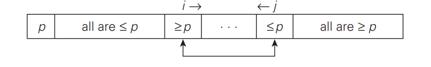
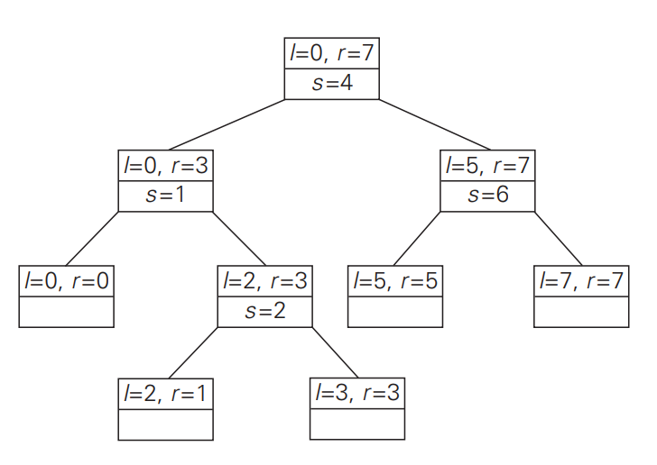

## What is Quicksort?

 Quicksort is a important sorting algorithm that is approach of divide-and-conquer. In a given array $A[0...n-1]$, pivot is defined as $A[s]$, make $A[]$ that all elements of $A[0...s-1]$ are smaller than the pivot and elements of $A[s+1...n-1]$ are greater than the pivot.


```
Partition(A[l...r])
{
    p <- A[l]
    i <- l+1; j <- r
    while(i <= j)
        while(A[i] >= p)
            i++
        while(A[j] <= p)
            j--
        swap(A[i], A[j])
    swap(A[l], A[j])    
    return j
}
```

After that, do same things with both $A[0...s-1]$ and $A[s+1...n-1]$ `recursively`.



```
Quicksort(A[l...r])
{
    if (l < r)
        s <- Partition(A[l...r])
        Quicksort(A[l...s-1])
        Quicksort(A[s+1...r])
}
```
